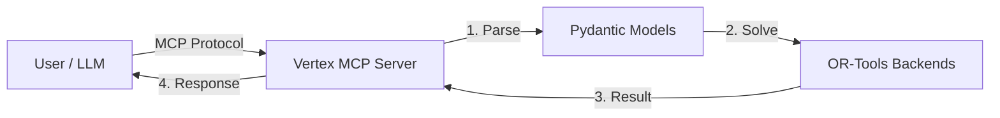

# System Architecture

Vertex is designed as a modular, stateless Model Context Protocol (MCP) server that exposes Operations Research capabilities to LLMs.

## High-Level Overview

The system bridges natural language requests (via LLMs) to mathematical optimization solvers.

## Key Components

### 1. Interface Layer (`server.py`)

- **Framework**: `mcp.server.fastmcp.FastMCP`
- **Transport**: Supports both `stdio` (for coding assistants like Claude Desktop) and `sse` (Server-Sent Events over HTTP for Docker/web).
- **Responsibility**: Handles JSON-RPC communication, validates input schemas, and routes requests to appropriate backend tools.

### 2. Data Models (`src/vertex/models/`)

- **Technology**: `pydantic`
- **Purpose**: Defines strict schemas for problems and solutions. This ensures type safety and provides clear structure for LLMs to generate.
- **Key Models**:
  - `LPProblem` / `LPSolution`: Core linear programming data.
  - `LPSensitivity`: Sensitivity analysis reports.
  - `VRPResult`: Route plans.

### 3. Solver Abstraction (`src/vertex/solvers/`)

- **Backend**: Google OR-Tools (`ortools`), CVXPY (`cvxpy` w/ `OSQP`).
- **Design**: The system uses a solver-agnostic design where possible, primarily backed by OR-Tools' GLOP (Linear), SCIP (MIP), and CVXPY/OSQP (Quadratic).
- **Components**:
  - `solve_lp`: Generic linear solver.
  - `solve_mip`: Mixed-integer solver.
  - `NetworkSolvers`: Specialized graph algorithms (e.g., Min Cost Flow).

### 4. Tool Templates (`src/vertex/tools/templates/`)

- **Purpose**: Domain-specific wrappers that simplify complex mathematical formulations into business-friendly inputs.
- **Examples**:
  - `optimize_diet`: Transforms food/nutrient data into an LP problem.
  - `optimize_production`: Transforms resource/profit data into an LP problem.
- **Benefit**: Reduces the cognitive load on the LLM; it doesn't need to know how to write constraints, just how to provide business data.

## Design Decisions

### Statelessness

The server is designed to be **stateless**. Every request contains all necessary data to solve the problem.

- **Pros**: Easy to scale (Docker/Kubernetes), no session management complexity.
- **Cons**: Large problem instances must be re-transmitted.

### Type Safety

We use strict Pydantic models for all inputs and outputs.

- **Why**: LLMs are better at adhering to strict JSON schemas than loose formats. This minimizes "hallucinated" parameters that don't exist in the solver.

### Dependency Management

We use `uv` for extremely fast dependency resolution and environment management, ensuring reproducible builds across development and production.
